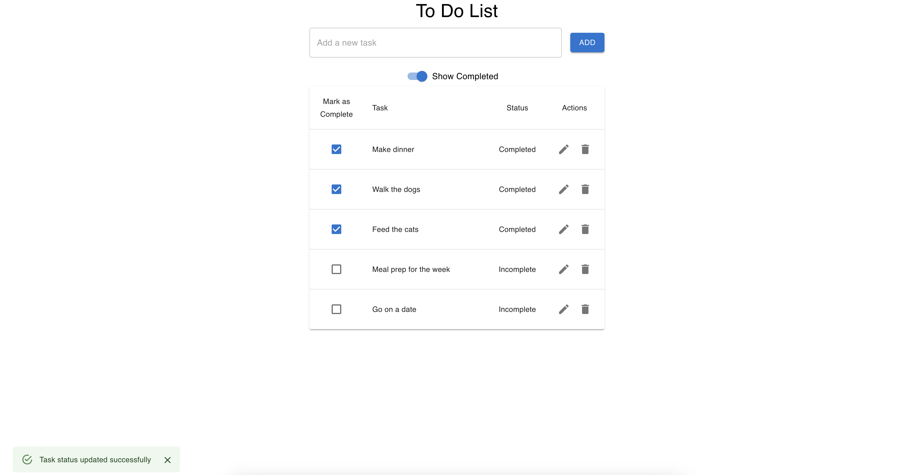
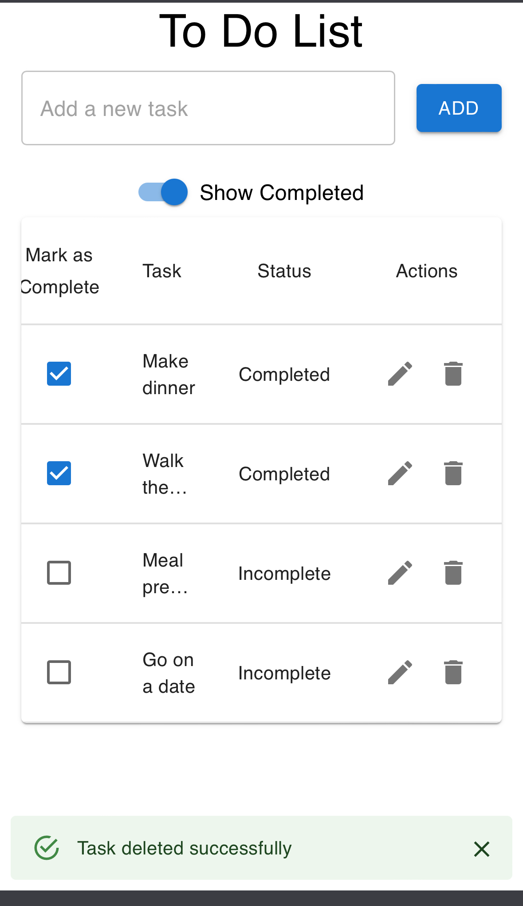

# To-Do List App

## Summary

The To-Do List App is a simple and intuitive task management application built with React, Material-UI, and supabase. It allows users to add, edit, and delete tasks, as well as mark tasks as complete or incomplete. The app also has functionality for toggling the visibility of completed tasks

## Table of Contents
- [Demo](#demo)
- [Setup](#setup)
- [Technologies](#technologies)
- [Design](#design)
- [Components](#components)
- [Resources](#resources)

## Demo
- Vercel: https://todo-app-phi-seven-91.vercel.app/

## Setup
To run this project locally, install using npm:

```
$ npm install
$ npm start
```

## Technologies
Project is created with:

- React
- [Material-UI](https://mui.com/) (MUI)
- [Supabase](https://supabase.com/) (for database management)

## Design

The app features a clean, user-friendly interface with a modern design. It uses Material-UI for styling and components, ensuring a responsive and aesthetically pleasing experience. The layout is organized into a table format to clearly present tasks and their statuses.

## Components

- **TodoInput**: A component for adding new tasks.
- **TodoItem**: Displays individual tasks with options to edit, delete, or mark as complete.
- **ToggleSwitch**: Allows users to toggle the visibility of completed tasks.
- **TodosContainer**: The main container that manages state and fetches data from Supabase.
- **TodoList**: Renders the list of tasks in a table format.

## Resources
- Favicon: https://www.favicon.cc/?action=icon&file_id=552373

## Screenshots

### Desktop View


### Mobile View

